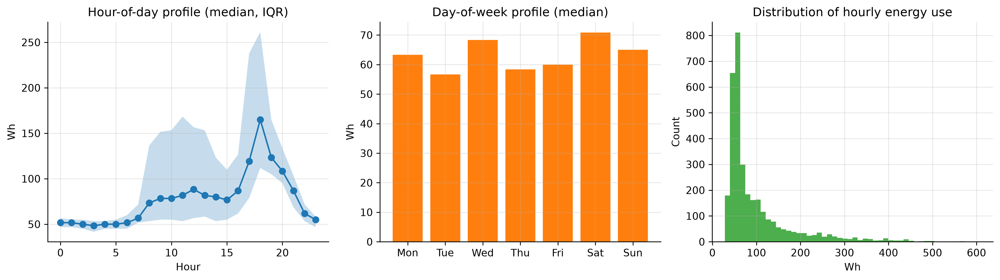
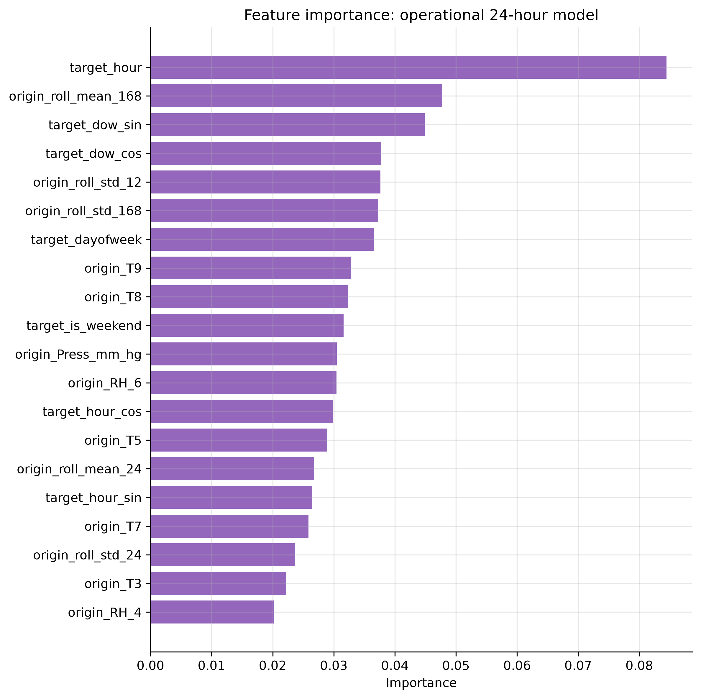
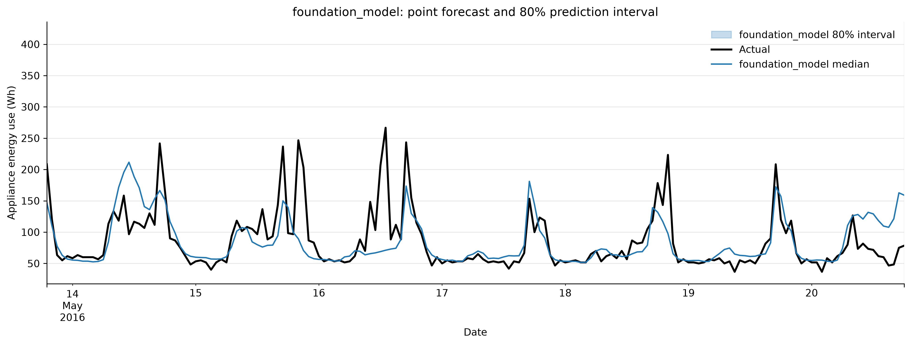
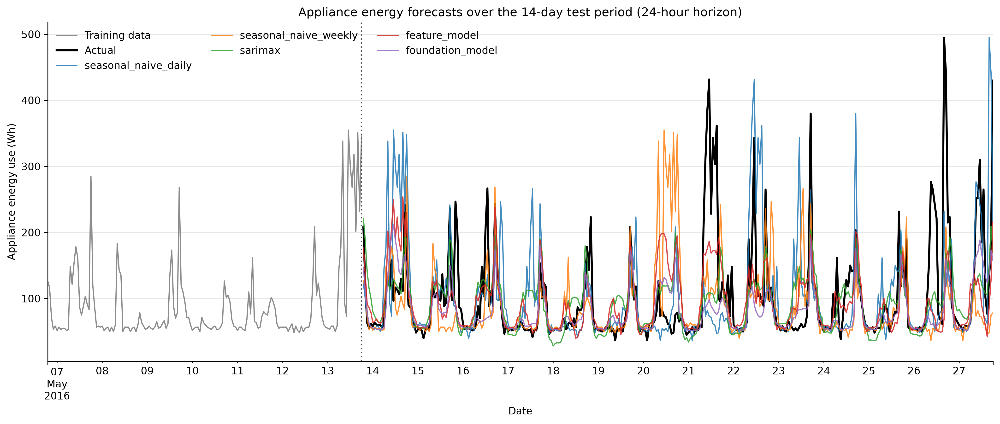
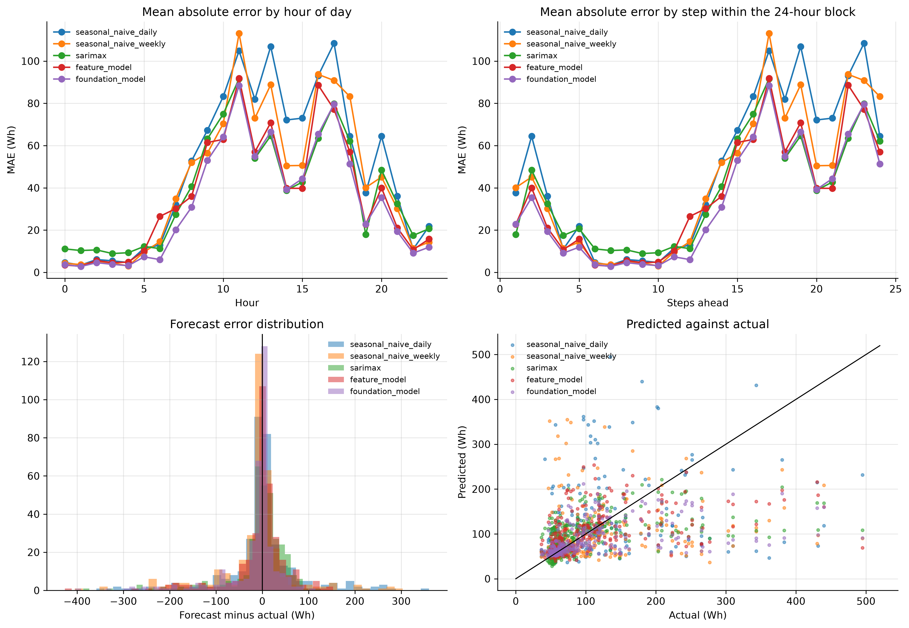
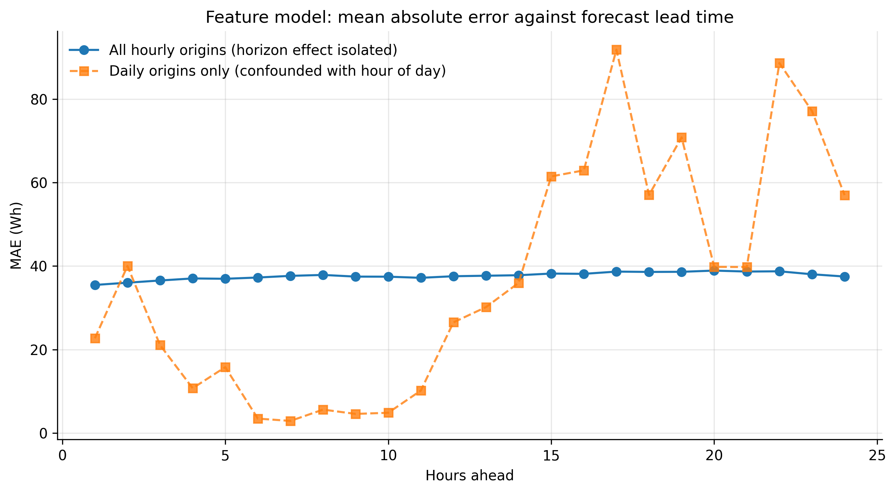

# Forecasting Household Appliance Energy Use

### A comparison of benchmark, statistical, machine-learning and foundation models at a 24-hour horizon

---

## 1. Introduction

Short-term forecasts of household electricity use underpin a range of practical
applications: scheduling flexible appliances against time-of-use tariffs, sizing home
battery systems, and giving demand-response aggregators something to plan against. The
question this report addresses is a narrow but useful one. If we want to forecast a single
household's appliance energy use 24 hours ahead, how much do increasingly sophisticated
models actually buy us over a simple average?

The analysis uses the Appliances Energy Prediction dataset, which records appliance
consumption alongside indoor sensors and outdoor weather for one house in Belgium over four
and a half months in 2016. Four model classes are compared: simple benchmarks, SARIMAX,
gradient boosting on an engineered feature table, and Chronos-2 used zero-shot.

The short answer is that the gains are small and mostly not statistically significant. Only
the foundation model beats the strongest benchmark by a margin that survives a significance
test, and even it loses to the benchmark on RMSE. The more interesting findings are about
*why*: the series is dominated by a stable seasonal profile plus a large irreducible
component driven by occupant behaviour, and the covariates that seem like they should help
do not.

---

## 2. Data and preprocessing

The raw file contains 19,735 observations at 10-minute resolution, from 11 January to 27
May 2016. It is unusually clean: every gap between consecutive observations is exactly ten
minutes, there are no duplicate timestamps and no missing values. No imputation was needed.

Following the brief's allowance, the data were resampled to hourly means, giving 3,290
observations across 137 days. Averaging rather than summing keeps the target on its
original Wh scale. This does discard information — the maximum falls from 1,080 Wh to 608
Wh and the standard deviation from 103 to 81 — but the mean is essentially unchanged at 98
Wh and the strong right skew survives. The hourly resolution is also arguably the more
relevant one for the applications above, since tariff periods and appliance scheduling
decisions operate at that granularity rather than at ten-minute resolution.

Two columns, `rv1` and `rv2`, were dropped: they are random variables the original authors
included as noise controls and carry no information.

The final 14 days (336 hourly observations, 13–27 May) are held out as the test period, as
recommended, leaving 2,954 training observations. Four months is enough to estimate daily
and weekly seasonality but not annual seasonality — a limitation carried through everything
that follows.

---

## 3. Exploratory analysis

The series is spiky rather than smooth. Long quiet stretches sit around 50 Wh — effectively
the standby load of the house — punctuated by short bursts reaching several hundred watt-hours.
Nearly half of all hours fall below 60 Wh, while a small minority carry most of the
variation. Skewness is 2.4.

The dominant structure is hour of day: a flat overnight trough from about 01:00 to 05:00, a
morning rise, and a broad evening peak between 17:00 and 20:00. Critically, the
interquartile band around this profile is narrow at night and very wide during the day,
which foreshadows where all the forecast error will end up.



Weekend days average slightly higher than weekdays, but the difference is small relative to
within-day variation. This is one household, so the weekly pattern reflects one family's
habits rather than any aggregate regularity.

The autocorrelation function shows clear local peaks at lags 24 and 168, confirming daily
and weekly seasonality, but the lag-24 autocorrelation is only about 0.4 and lag-168 is
lower still. The seasonality is real but weak — an early warning that MASE values will sit
close to 1. An augmented Dickey-Fuller test rejects a unit root and KPSS does not reject
stationarity around a constant, so ordinary differencing is unnecessary; seasonal
differencing at lag 24 is still warranted.

Importantly for later, no covariate is strongly related to the target. The `lights` channel
is the best of them, which makes sense since lights being on proxies for someone being home,
but even that is moderate. The weather variables are weak.

---

## 4. Forecasting design

The brief specifies a 24-hour horizon and recommends the final 14 days as the test period.
These are not the same requirement, and reconciling them matters more than it first appears.

The design adopted here is a **rolling-origin evaluation**: the 336 test observations are
forecast as fourteen consecutive blocks of 24 hours. At each origin, every model sees all
data observed up to that point and forecasts the next day. Every number reported below
therefore describes accuracy at the 24-hour horizon that the brief actually asks about.

The alternative — forecasting all 336 points from a single origin two weeks out, as the
demo pipeline does — was also run, as a sensitivity check (Section 9).

All models are scored with MAE, RMSE, MASE and bias on identical test points. The MASE
scaling factor is the in-sample mean absolute error of a 24-hour seasonal naive forecast on
the training data (53.42 Wh), computed once and held fixed so that the denominator never
changes between models.

Three leakage distinctions are enforced throughout, and they are the methodological core of
this report.

**Future values of the target.** Standard, and handled by shifting all lag and rolling
features. Verified by automated tests.

**Information unavailable at the forecast origin.** Much subtler. A feature shifted by one
hour relative to the *target* is not necessarily known at an origin 24 hours earlier. This
is discussed at length in Section 7.

**Covariates that would not themselves be forecastable.** Calendar variables are known
arbitrarily far ahead; indoor sensor readings and outdoor weather at the target time are
not. Models using realised test-period weather are labelled conditional forecasts.

---

## 5. Benchmark models

Five benchmarks are required by the brief. A sixth — an hour-of-week mean profile, which
averages every past observation falling in the same slot of the week — was added because it
is the natural low-variance competitor to the seasonal naive forecasts.

| Benchmark | MAE | RMSE | MASE | Bias |
|---|---|---|---|---|
| Hour-of-week mean profile | 38.06 | 63.74 | **0.712** | -3.39 |
| Weekly seasonal naive | 43.46 | 81.41 | 0.813 | -13.16 |
| Daily seasonal naive | 48.31 | 85.57 | 0.904 | 1.75 |
| Mean | 50.26 | 74.94 | 0.941 | -3.29 |
| Naive | 85.55 | 110.39 | 1.601 | 50.98 |
| Drift | 85.80 | 110.68 | 1.606 | 51.37 |

The ordering is informative in three ways.

First, `naive` and `drift` are hopeless, with MASE above 1.6 and a large positive bias of
about 51 Wh. Both hold the 18:00 value constant across the following day, and since 18:00
sits near the daily peak they carry that elevated level straight through the night. The
`mean` forecast beats both simply by refusing to commit to a level.

Second, and more interestingly, the three seasonal methods rank in the opposite order to
naive intuition: daily seasonal naive (0.904) is *worse* than weekly (0.813), which is worse
than the mean profile (0.712). Averaging beats copying, and copying last week beats copying
yesterday.

Third, the reason for that ordering explains most of what follows. The weekly seasonal naive
forecast is about as variable as the series itself, since it copies a real week complete with
its idiosyncratic spikes; the mean profile is far smoother. Where the *timing* of peaks is
close to unpredictable, smoothness pays, because a misplaced peak is penalised twice — once
for the peak that did not occur and once for the one that did.

**This tells us something concrete about the household.** Day-to-day behaviour is noisy
enough that yesterday is a poor guide to today, but a stable average weekly rhythm exists
underneath. The strongest benchmark is the mean profile at MASE 0.712, and that is the number
every subsequent model must beat.

---

## 6. SARIMAX model

Three specifications were compared, chosen to isolate the effect of covariate availability
rather than to search exhaustively over orders.

Notebook 02 established `d = 0` (no unit root) with a strong lag-24 cycle, pointing to
`D = 1` at `s = 24`. After seasonal differencing, residual autocorrelation is much reduced
with a large negative spike at lag 24, the signature of a seasonal MA term. The
specification `SARIMA(1,0,1)(1,1,1)[24]` follows, which is also the brief's suggested
starting point.

| Model | Exogenous | AIC | MASE |
|---|---|---|---|
| Target only | none | **32,229.7** | **0.682** |
| + calendar | hour/day Fourier terms, weekend flag | 32,235.7 | 0.702 |
| + calendar and weather | plus T_out, RH_out, wind, visibility, dew point | 32,242.8 | 0.713 |

**Adding covariates makes the model worse, and the out-of-sample ordering matches the
in-sample ordering exactly.** AIC rises monotonically, so the extra parameters do not pay
for themselves even in sample. Since the seasonal difference already removes the daily
cycle, the calendar regressors are largely redundant; and as Section 3 showed, the weather
variables carry little information about this household.

Only the target-only model beats the benchmark, by about 4%.

The residual diagnostics are mixed. The residual ACF sits largely inside the confidence
bands, so most linear dependence has been absorbed, but Ljung-Box still rejects at lags 24
and 48. The residuals are also strongly right-skewed — the spikiness of the series showing
through — and that skew has a direct consequence. All three specifications produce nominal
80% intervals containing 91% of observations, at an average width of about 181 Wh against a
test-period interquartile range of roughly 62 Wh. The Gaussian assumption forces the model
to accommodate occasional 400 Wh spikes by inflating variance everywhere, including quiet
overnight hours when consumption is reliably near 50 Wh. An interval that wide at 03:00 is
useless for any practical decision: over-coverage is a calibration failure, not a safety
margin.

---

## 7. Feature-based model

Gradient boosting (XGBoost, 600 trees, learning rate 0.03, depth 6) was fitted to an
engineered feature table. Most of the work here went into the design of that table rather
than the model, because the design determines whether the result means anything.

### The problem with the obvious design

The natural supervised table shifts every feature by at least one period:

```python
data["lag_1"] = data["Appliances"].shift(1)
data["roll_mean_24"] = data["Appliances"].shift(1).rolling(24).mean()
```

No feature uses a future value of the target, so this passes the usual leakage check. It is
a correct **one-step-ahead** design.

It is not a valid **24-hour-ahead** design. Forecasting at 18:00 on Monday for 17:00 on
Tuesday, `lag_1` would be the value at 16:00 on Tuesday — which has not happened yet. The
shift protects against using the future relative to the *target*; it does not protect
against using information unavailable at the *forecast origin*, and those differ by up to
24 hours.

### The operational design

Each row is a (forecast origin, horizon) pair, with three feature groups: quantities
measured at the origin (lagged target values, rolling statistics, latest sensor and weather
readings); calendar features of the target timestamp, which are known arbitrarily far
ahead; and the horizon itself. This yields 74,628 rows and 54 features.

| Design | MASE | Valid at 24h? |
|---|---|---|
| One-step (uses `lag_1`) | 0.602 | **No** |
| Operational (origin-only information) | 0.687 | Yes |
| Operational + realised future weather | 0.765 | Conditional only |

The one-step design appears 12% better. That entire gap is `lag_1`. It would be easy to
report 0.602 in good faith as the model's 24-hour accuracy — it passes every standard
leakage test — but it is the accuracy of a model told the previous hour's consumption,
which at a 24-hour horizon it cannot be. It is reported here as a diagnostic and excluded
from every ranking.

Adding realised future weather makes things worse again, from 0.687 to 0.765. This does not
mean weather is harmful information. It means the extra columns let the model fit noise in
a training sample where weather barely relates to appliance use, and that overfitting costs
more than the covariates are worth. Conveniently, the model we could actually deploy
outperforms the one requiring information we could not have.

### What the model learned



`target_hour` is the most important feature by a wide margin, followed by the 168-hour
rolling mean and the day-of-week terms. Grouped by type, calendar features carry more weight
than any other group. The indoor sensors contribute something — plausibly because room
temperature is a lagged indicator of occupancy — but no individual sensor is decisive.

In other words, the gradient boosting model rediscovered the hour-of-week profile and added
a modest level correction from recent history. That is why it only edges past the benchmark.

---

## 8. Foundation model

Chronos-2 (`amazon/chronos-2`) was used zero-shot: no parameter of the network was updated
using appliance data. At each of the fourteen origins the model received the observed
history as context and returned quantiles for the next 24 hours.

Some precision about "zero-shot" is warranted. In our procedure no fitting occurred, and the
model did see the series history at inference time as context — that is the intended use.
However, Chronos was pre-trained by Amazon on a large corpus of time series, and we cannot
verify that this dataset was excluded. Appliances Energy Prediction is a well-known public
UCI dataset. If it were present in pre-training, the zero-shot claim would be weaker than it
appears. This caveat applies to any evaluation of a foundation model on a public benchmark
and cannot be resolved from the outside.

| Model | MAE | RMSE | MASE | Bias |
|---|---|---|---|---|
| Chronos-2 | **32.82** | 67.09 | **0.614** | -18.65 |
| Best benchmark | 38.06 | **63.74** | 0.712 | -3.39 |

At MASE 0.614, Chronos-2 is the best valid 24-hour-ahead model in the study — a 14%
improvement over the strongest benchmark, with no fitting, no feature engineering and no
tuning.

**But it has the best MAE and the worst RMSE of the serious models**, and a bias about three
times larger than anything else. These three facts describe a single behaviour: it forecasts
the typical hour very accurately and systematically undershoots peaks. MAE rewards that,
because most hours are typical. RMSE punishes it, because squared error is dominated by the
few hours where consumption spikes to 400 Wh and the forecast says 150. On RMSE the simple
mean profile wins outright.

Where Chronos is unambiguously ahead is the predictive distribution.

| Model | Nominal | Empirical coverage | Average width |
|---|---|---|---|
| Chronos-2 | 80% | 77.7% | **92 Wh** |
| SARIMAX (all variants) | 80% | 91.1% | 181 Wh |

Chronos is marginally under-covering where SARIMAX substantially over-covers, and it
achieves this with intervals **half as wide**. The reason is structural: Chronos produces
quantiles directly and is not constrained to a symmetric Gaussian error distribution, so it
can represent a series with a hard floor near 50 Wh and a long right tail. For probabilistic
forecasting this is a decisive advantage.



---

## 9. Results and error analysis

### Are the differences real?

A ranking on 336 observations means little without a significance test. Diebold-Mariano
tests against the strongest benchmark, using absolute error and a Newey-West variance
estimate:

| Model | DM statistic | p-value | Significantly better? |
|---|---|---|---|
| Chronos-2 | 2.36 | 0.018 | **Yes** |
| SARIMAX + calendar | 0.32 | 0.748 | No |
| Feature model | 0.62 | 0.534 | No |
| SARIMAX + weather | -0.02 | 0.988 | No |
| Feature model, conditional | -1.34 | 0.181 | No |
| Weekly seasonal naive | -1.47 | 0.141 | No |
| Daily seasonal naive | -2.35 | 0.019 | Significantly *worse* |

Of three increasingly sophisticated model classes, exactly one produces an improvement that
survives a significance test. The feature model's 3.5% edge and SARIMAX's 4% edge are
indistinguishable from noise.

### The universal failure: peaks



The actual series reaches 495 Wh during the test period. No model forecasts above 254 Wh.
In the top decile of hours, every model carries a bias between -130 and -190 Wh.

This is not a tuning failure. All these models estimate a conditional mean or median, and
the conditional distribution of appliance use in a peak hour is genuinely wide — the
household sometimes cooks at 18:00 and sometimes does not. Under squared or absolute loss
the optimal point forecast sits in the middle, so peaks are underestimated by construction.
The remedy is not a better point forecast but a probabilistic one, which is where Chronos's
sharp, well-calibrated intervals earn their place.

### When errors occur



Errors are tiny overnight — 3 to 5 Wh between 01:00 and 05:00 — and an order of magnitude
larger between 10:00 and 20:00. The forecasting problem is close to trivial for two thirds
of the day and hard for the other third. All the difficulty lies in hours when consumption
is driven by discretionary human decisions.

### A correction on error by horizon

The pipeline's `mae_by_horizon.csv` appears to show error growing steeply with lead time. It
does not, and the reason is worth stating because it is an easy mistake to make.

Because the design issues one forecast per day at a fixed time (18:00), step *h* always
lands on hour *(18 + h) mod 24*. Horizon and time of day are perfectly confounded: the
horizon table is an exact rotation of the hour-of-day table. Any apparent horizon effect is
a time-of-day effect wearing a disguise.

`scripts/horizon_analysis.py` breaks the confound by re-issuing the feature model from
every hour in the test period rather than once a day, so each horizon step averages across
all 24 clock times. Each step is then evaluated on 336 forecasts issued from 359 distinct
origins.



Corrected, MAE rises from 35.5 Wh at one hour ahead to a maximum of 38.9 Wh at twenty hours
ahead — a linear trend of just +0.10 Wh per hour of lead time, or under 10% degradation
across an entire day. Set that against the 24-fold swing, from 2.9 Wh to 91.8 Wh, that the
confounded version appeared to show.

The corrected curve also has a feature the confounded one hides: accuracy improves again at
the longest horizons, falling back to 37.5 Wh at h = 24. The explanation is the structure of
the feature set. At h = 24 the most recent observation available at the origin is exactly the
same hour on the previous day, so the model's `origin_lag_0` feature coincides with the
daily seasonal lag and becomes informative again. Predictability is highest when the origin
is either very recent or exactly one seasonal period away, and worst in between.

Both observations point the same way: almost all the predictable signal is the seasonal
profile, equally available at any lead time, and almost none is short-run momentum that
decays as the horizon extends. It also explains why the one-step design looked so much
better — `lag_1` is close to the only genuinely horizon-sensitive information in the
dataset.

### Sensitivity to evaluation design

Repeating everything as a single 336-step-ahead forecast leaves the seasonal benchmarks and
all three model classes essentially unchanged. Only `naive` and `drift` differ, collapsing
from MASE 1.60 to 4.69 and 4.99.

The substantive findings do not depend on the choice of design. What the design does change
is how bad the worst benchmarks look — which is a reason to treat sceptically any study
reporting large improvements over a naive benchmark evaluated over a long single block.

---

## 10. Discussion and limitations

**Which covariates would genuinely be known at the forecast origin?** Calendar variables —
hour, day of week, weekend, holidays — are known arbitrarily far ahead and are the only
covariates used by the operational models. Weather at the target time would in practice come
from a numerical weather forecast, which carries its own error; using realised values, as
done here for the conditional variants, is optimistic. Indoor sensor readings at the target
time are the least defensible: forecasting indoor temperature 24 hours ahead is roughly as
hard as the original problem. All indoor sensors therefore enter the operational models only
at their origin-time values.

Since every covariate set made forecasts worse, nothing in the conclusions depends on this
distinction. But the discipline was maintained throughout, and had covariates helped, the
distinction would have been essential.

**Limitations.**

The sample covers four and a half months of one household, so nothing here generalises to
annual seasonality, to other households, or to aggregated demand — where behavioural noise
averages out and covariates like temperature typically matter far more. The test period is
a single fortnight in May; a different fortnight might rank the models differently, and the
Diebold-Mariano results should be read with that in mind.

No systematic search over SARIMAX orders was performed. Each fit takes 20 to 150 seconds and
the specifications differ by less than 0.05 MASE, so a different order would not change any
conclusion, but a better specification cannot be excluded. Chronos was used target-only; it
supports covariates, and although Sections 6 and 7 give good reason to expect little benefit,
this was not tested. Finally, XGBoost results are not bit-identical across platforms, so
figures may vary by a few percent between machines.

---

## 11. Conclusion

**Which benchmark is strongest, and what does that reveal?** The hour-of-week mean profile,
at MASE 0.712, beating both seasonal naive variants. Averaging beats copying because the
timing of peaks is close to unpredictable, and a misplaced peak is penalised twice. The
household has a stable average weekly rhythm overlaid with substantial day-to-day noise.

**Does SARIMAX improve on it?** Marginally and not significantly — 0.682, about 4%, with
p = 0.99 on a Diebold-Mariano test against the benchmark.

**Do covariates help?** No. Every covariate set tried made things worse, in AIC and out of
sample, for both SARIMAX and gradient boosting. Adding perfect future weather to the feature
model degraded it from 0.687 to 0.765.

**Does the feature-based model improve?** By 3.5% (0.687), not statistically significant.
Feature importances show it largely rediscovered the hour-of-week profile.

**Does the foundation model outperform?** On MAE and MASE, yes — 0.614, a 14% improvement
and the only statistically significant one (p = 0.018). On RMSE, no: it is the worst of the
serious models, because it undershoots peaks harder than anything else. On interval quality
it is the clear winner, achieving near-nominal coverage with intervals half the width of
SARIMAX's.

**Which model would I recommend for a practical smart-home system?** It depends on which
error matters, and the honest recommendation is split.

For a system scheduling flexible loads against a tariff, where being wrong by 30 Wh in
either direction is roughly equally costly, **Chronos-2 zero-shot** is the recommendation:
lowest MAE, the only significant improvement over the benchmark, by far the best-calibrated
intervals, and no fitting, feature engineering or retraining as the household's habits
drift. The cost is a PyTorch dependency and roughly half a second of inference per forecast.

Where peak errors dominate — battery sizing, avoiding peak-demand charges — the
recommendation would differ, since Chronos has the worst RMSE and the largest bias on test.
There the hour-of-week mean profile is competitive on RMSE and costs nothing to run.

The broader conclusion is worth stating plainly. On this series, four months of engineering
effort across three model classes bought a 14% MAE improvement over an average that can be
computed in three lines of pandas, and two of those three classes bought nothing measurable
at all. Most of the variation in a single household's appliance use is not a function of
time, weather, or its own past. It is a function of what the occupants decided to do, and
that is not in the data.
